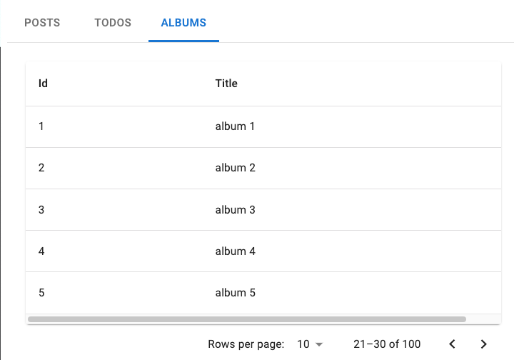
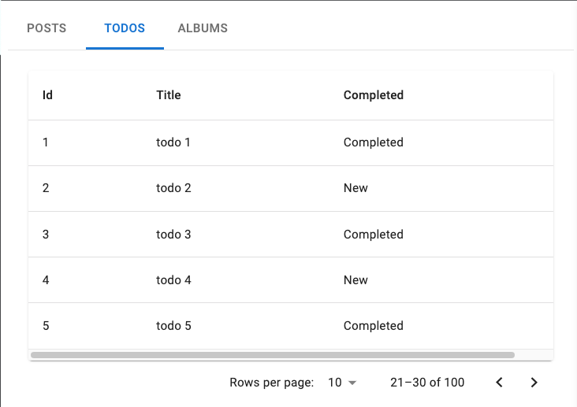
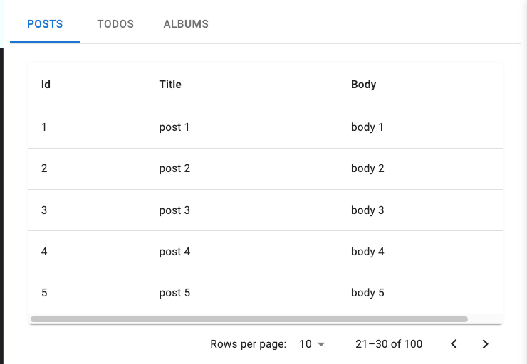

# React + Vite

- custom hook
- UI Component (anything you want)

## API

- albums:https://jsonplaceholder.typicode.com/albums?_limit=5&_page=1
- todos: https://jsonplaceholder.typicode.com/todos?_limit=5&_page=1
- posts: https://jsonplaceholder.typicode.com/posts?_limit=5&_page=1

## Table Column

#### Albums: id, title

#### Todos: id, title, completed

#### Posts: id, title, body

# Requirement

### Tasks

- show table data
- allow pagination (limit, prev page, next page)
